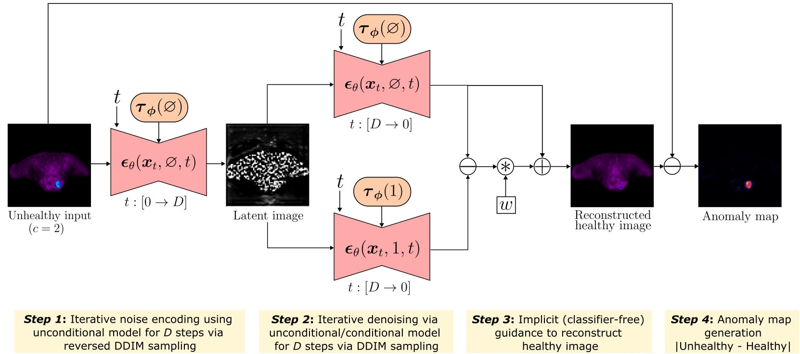

# IgCONDA-PET: Implicitly-guided Counterfactual Diffusion for Detecting Anomalies in PET Images


## Introduction
This codebase is related to our submission to MICCAI 2024:<br>
> Anonymous authors, _IgCONDA-PET: Implicitly-Guided Counterfactual Diffusion for Detecting Anomalies in PET Images_.

<p align="justify">
Minimizing the need for pixel-level annotated data for training PET anomaly segmentation networks is crucial, particularly due to time and cost constraints related to expert annotations. Current un-/weakly-supervised anomaly detection methods rely on autoencoder or generative adversarial networks trained only on healthy data, although these are more challenging to train. In this work, we present a weakly-supervised and <b>I</b>mplicitly <b>g</b>uided <b>CO</b>u<b>N</b>terfactual diffusion model for <b>D</b>etecting <b>A</b>nomalies in <b>PET</b> images, branded as <b>IgCONDA-PET</b>. The training is conditioned on image class labels (healthy vs. unhealthy) along with implicit guidance [3] to generate counterfactuals for an unhealthy image with anomalies. The counterfactual generation [4] process synthesizes the healthy counterpart for a given unhealthy image, and the difference between the two facilitates the identification of anomaly locations. In this work, we use two publicly available oncological FDG PET datasets, AutoPET [1] and HECKTOR [2].
</p>

<p align="center">

</p>
<p align="center", style="font-size:10px">
    Figure 1: IgCONDA-PET: Implicitly-guided counterfactual DPM sampling methodology for domain translation between an unhealthy image and its healthy counterfactual for PET. The anomaly map is defined as the absolute difference between the unhealthy and corresponding reconstructed healthy image.
</p>

<p align="center">
  
</p>
<p align="center", style="font-size:10px">
    Figure 2: Qualitative comparison between the PET anomaly maps generated by our method (last column) with other methods (columns 3-6) . GT represents the physician’s dense ground truth. Here, we set the noise level <i>D</i> = 400 and <i>w</i> = 3.0.
</p>


## How to get started?
Follow the intructions given below to set up the necessary conda environment, install packages, preprocess dataset in the correct format so it can be accepted as inputs by the code, train model and perform anomaly detection on test set using the trained models. 

- **Clone the repository, create conda environment and install necessary packages:** The first step is to clone this GitHub codebase in your local machine, create a conda environment, and install all the necessary packages. This code base was developed primarily using python=3.8.10, PyTorch=1.11.0, monai=1.3.0, with CUDA 11.3 on an Ubuntu 20.04 virtual machine, so the codebase has been tested only with these configurations. We hope that it will run in other suitable combinations of different versions of python, PyTorch, monai, and CUDA, but we cannot guarantee that. Proceed with caution!
    ```
    git clone 'https://github.com/igcondapet/IgCONDA-PET.git'
    cd IgCONDA-PET
    conda env create --file requirements.yaml
    ```
    The last step above creates a conda environment named `igcondapet`. Make sure you have conda installed. Next, activate the conda environment
    ```
    conda activate igcondapet
    ```

- **Preprocess AutoPET and HECKTOR datasets:** Go to [config.py](config.py) and set path to data folders for AutoPET and HECKTOR datasets and the path where you want the preprocessed data to be stored. 
    ```
    path_to_autopet_data_dir = '' # path to AutoPET data
    path_to_hecktor_data_dir = '' # path to hecktor data 
    path_to_preprocessed_data_dir = '' # path to directory where you want to store your preprocessed data
    ```
    The directory structure within `path_to_autopet_data_dir` and `path_to_hecktor_data_dir` should be as shown below. The folders `images` and `labels` must contain all the 3D PET and ground truth images for each datasets in `.nii.gz` format. Notice, the PET image filenames (excluding `.nii.gz` extension) end with `_0001` for AutoPET data, and with `__PT` for HECKTOR data. Ensure that your files are renamed in this format before proceeding. Information about the images included in the training, validation and test phases in this work are given in [data_split/metadata3D.csv](data_split/metadata3D.csv). Your filenames for PET and ground truth images should exactly match the filenames in the columns `PTPATH` and `GTPATH` in this file. 

        └───path_to_autopet_data_dir/
            ├── images
            │   ├── Patient0001_0001.nii.gz
            │   ├── Patient0002_0001.nii.gz
            │   ├── ...
            ├── labels
            │   ├── Patient0001.nii.gz
            │   ├── Patient0002.nii.gz 
            │   ├── ...

        └───path_to_hecktor_data_dir/
            ├── images
            │   ├── Patient0261__PT.nii.gz
            │   ├── Patient0262__PT.nii.gz
            │   ├── ...
            ├── labels
            │   ├── Patient0261.nii.gz
            │   ├── Patient0262.nii.gz 
            │   ├── ...

    This step centrally crops and downsamples the images (from both the datasets) to `64 x 64 x 96` and then saves the individual axial slices (96 slices per image) to your local device. The downsampled 3D images and 2D images are stored under `path_to_preprocessed_data_dir/preprocessed3D` and  `path_to_preprocessed_data_dir/preprocessed2D`, respectively. If your data is stored exactly as shown in the schematic above, run the data preprocessing step using [preprocess_data/preprocess_data.py](preprocess_data/preprocess_data.py)
    ```
    cd preprocess_data
    python preprocess_data.py
    ```

- **Run training:** The file [igcondapet/trainddp.py](igcondapet/trainddp.py) runs training on the 2D dataset via PyTorch's `DistributedDataParallel`. To run training, do the following (an example bash script is given in [igcondapet/trainddp.sh](igcondapet/trainddp.sh)):
    ```
    cd igcondapet
    torchrun --standalone --nproc_per_node=1 trainddp.py --experiment='exp0' --attn-layer1=False --attn-layer2=True --attn-layer3=True --epochs=400 --batch-size=32 --num-workers=4 --cache-rate=1.0 --val-interval=10
    ```
    Use a unique `--experiment` flag everytime you run a new training. Set `--nproc_per_node` as the number of GPU nodes available for parallel training. The data is cached using MONAI's `CacheDataset`, so if you are running out of memory, consider lowering the value of `cache_rate`. During training, the training and validation losses are saved under `./results/logs/trainlog_gpu{rank}.csv` and `./results/logs/validlog_gpu{rank}.csv` where `{rank}` is the GPU rank and updated every epoch. The checkpoints are saved every `val_interval` epochs under `./results/models/checkpoint_ep{epoch_number}.pth`.

- **Run evaluation on test set:** After the training is finished (for a given `--experiment`), [igcondapet/inference.py](igcondapet/inference.py) can be used to run evaluation on the unhealthy 2D test dataset and save the results. To run test evaluation, do the following (an example bash script is given in [igcondapet/inference.py](igcondapet/inference.py)):
    ```
    cd igcondapet
    python inference.py --experiment='exp0' --attn-layer1=False --attn-layer2=True --attn-layer3=True --guidance-scale=3.0 --noise-level=400 --num-workers=4 --cache-rate=1.0 --val-interval=10
    ```
    [igcondapet/inference.py](igcondapet/inference.py) uses the model with the lowest loss on the validation set for test evaluation. CAUTION: set `--val-interval` to the same value that was used during training.  


# References

<a id="1">[1]</a> 
Gatidis, S., Kuestner, T.: "A whole-body FDG-PET/CT dataset with manually annotated tumor lesions (FDG-PET-CT-Lesions)" [Dataset] (2022), The Cancer Imaging Archive. 
[](https://doi.org/10.7937/gkr0-xv29)

<a id="2">[2]</a> 
Andrearczyk, V., Oreiller, V., Boughdad, S., Rest, C.C.L., Elhalawani, H., Jreige, M., Prior, J.O., Valli`eres, M., Visvikis, D., Hatt, M., et al.: "Overview of the hecktor challenge at miccai 2021: automatic head and neck tumor segmentation and outcome prediction in pet/ct images", In: 3D head and neck tumor segmentation in PET/CT challenge, pp. 1–37. Springer (2021). 

<a id="3">[3]</a> 
Ho, J., Salimans, T.: "Classifier-free diffusion guidance". arXiv preprint arXiv:2207.12598 (2022)

<a id="4">[4]</a> 
Sanchez, P., Kascenas, A., Liu, X., O’Neil, A.Q., Tsaftaris, S.A.: "What is healthy? generative counterfactual diffusion for lesion localization". In: MICCAI Workshop on Deep Generative Models. pp. 34–44. Springer (2022)